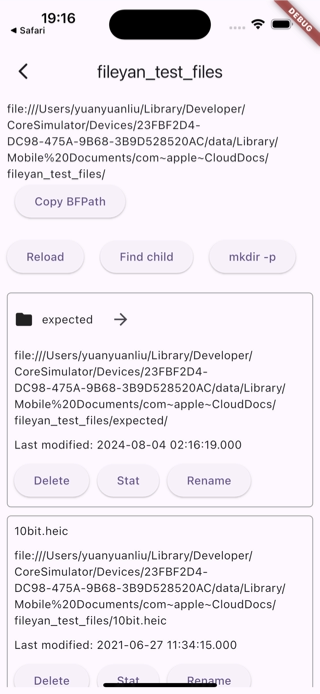
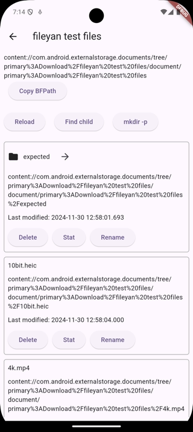
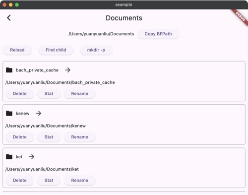

> [!WARNING]  
> Experimental. Expect breaking changes and don't use it in production.

# bull_fs

Unified file system APIs for Dart IO, Android SAF, and iOS / macOS `NSFileCoordinator` (mostly for iCloud access).

## APIs

### `BFEnv`

`BFEnv` is the core of this package. Each support platform has its own implementation of `BFEnv`. This class defines a set of supported file-system APIs. There are 3 implementations:

- `BFLocalEnv`: for local file system, a wrapper around Dart IO.
- `BFSafEnv`: for Android Storage Access Framework (SAF).
- `BFNsfcEnv`: for iOS / macOS `NSFileCoordinator` (mostly for iCloud access).

Below is a good summary of what to use on different platforms:

| Platform        | Which `BFEnv` to use                                                              |
| --------------- | --------------------------------------------------------------------------------- |
| iOS             | Use `BFNsfcEnv` for directory access and `BFLocalEnv` for file picker results ⚠️. |
| Android         | Use `BFSafEnv` if you need SAF access.                                            |
| macOS           | Use `BFNsfcEnv` for iCloud directory access and `BFLocalEnv` for others.          |
| Windows / Linux | Use `BFLocalEnv`                                                                  |

- ⚠️: On iOS, file picker results can be used as local file paths. But they are sandboxed, you have to call [accessing_security_scoped_resource](https://pub.dev/packages/accessing_security_scoped_resource) before accessing them.

### `BFPath`

Due to platform differences. Platform paths are represented by `BFPath` instead of `String`. It can be the following types:

- `BFLocalPath`: for Dart IO. e.g `/path/to/file`.
- `BFScopedPath`: a scoped path.
  - When used with `BFSafEnv`, it's a URI. e.g `content://com.android.externalstorage.documents/document/primary:Download/file.txt`.
  - When used with `BFNsfcEnv`, it's an iOS / macOS file URL. e.g. `file:///path/to/file`.

### Supported APIs

- List directory content:
  - `list`: Lists sub-directories and files in a directory.
  - `listDirContentFiles`: a platform optimized version of `list` that only lists files recursively.
- Get stats:
  - `stat`: Gets file or directory info.
  - `child`: Gets a child file or directory.
  - `fileExists`: Checks if a file exists.
  - `directoryExists`: Checks if a directory exists.
- Read / write files:
  - With local files:
    - `copyToLocalFile`: Copies a [BFPath] to a local file.
    - `pasteLocalFile`: Copies a local file to a [BFPath].
  - With streams:
    - `readFileStream`: Reads a file as a stream.
    - `writeFileStream`: Writes a stream to a file.
  - With `Uint8List`:
    - `readFileBytes`: Reads a file as a `Uint8List`.
    - `writeFileBytes`: Writes a `Uint8List` to a file.
- Create directories:
  - `mkdirp`: Creates directories recursively.
  - `createDir`: Creates a directory. Unlike `mkdirp`, it always creates a new directory.
- Delete / rename / move files or directories:
  - `delete`: Deletes a file or directory.
  - `rename`: Renames a file or directory.
  - `moveToDir`: Moves a file or directory to another directory.

## Examples

Clone this repo and run example project. Click `example` button. You can see how a single set of APIs work on different platforms.

| iOS                          | Android                              | macOS                            |
| ---------------------------- | ------------------------------------ | -------------------------------- |
|  |  |  |

## Tests

`bull_fs` tests can run on device. To run tests, run example project and click `tests` button.
